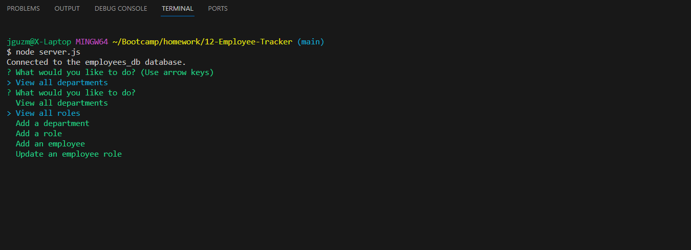

# Employee Tracker

## Description

This app is used to manage a database of employees which includes viewing departments, roles, employees, add a department, role, employee, and update and employee roles.

## Installation

N/A, runs in the terminal.

## Usage

The user is prompted with options which allow them to manipulate the database.

## Mock-Up

The following image shows the web application's appearance and functionality: 

## Video preview Link

https://drive.google.com/file/d/1CFLYmsbRdJV7UnujwrdA4nJVJqlujAk9/view?usp=sharing

## Built With

-Node.js
-Inquirer
-MySQL